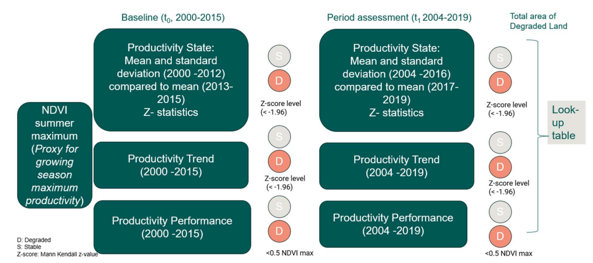

# EOSDG WP2 processing tools for Landsat mosaics for Trends in Land Productivity and SDG 15.3.1 Land Degradation subindicators 

Indicator methods follow the following guidelines 

https://www.unccd.int/sites/default/files/relevant-links/2021-03/Indicator_15.3.1_GPG_v2_29Mar_Advanced-version.pdf
https://www.unccd.int/resources/manuals-and-guides/addendum-good-practice-guidance-sdg-indicator-1531-proportion-land

The method for the estimation of the land productivity indicator was adapted to national needs in Finland described in:

Hurskainen, P., Alkio, E., Attila, J. , Bruun, E., Böttcher, K., Fleming, V., Helminen, V., Hoikkola, L., Huttunen, M., Kervinen, M., Menberu, M., Mitikka, S., Rehunen, A., Riihimäki, J., Tammelin, M., Törmä, M. (2025), 2023-FI-GEOS-EOSDG Capacity building for SDG monitoring and reporting through Earth Observation Methodological Report, Deliverable D1.5. (chapter 6)

## Input data

First make sure that the raster data is tiled and has reasonable tile size: 512, 1024 or max 2048 pixels. Otherwise partial data access will be slow.

If necessary, convert to COG with

        cd <path-to-files>
        mkdir cog
        for f in *.tif; do  gdal_translate -co NUM_THREADS=ALL_CPUS -of COG -co "BIGTIFF=YES"  $f cog/$f; done

You can refer to the example dataset in [sdg1531_example_data.zip](../../releases/download/v0.1-alpha/sdg1531_example_data.zip) to see samples of the input data, and [Workflow-example.md](Workflow-example.md) for workflow demonstration.

### Yearly max(NDVI) from Landsat data 

This dataset contains pre-computed yearly maximum of NDVI for all years in GeoTIFF format. AOI covers whole Finland and some of the surrounding areas.
Pixel resolution is 20 m, data has been scaled to integers with ndvi_int = ndvi*100 + 100 and saved as uint8. Values are automatically scaled back to -1, 1 during processing.

NOTE: All input files should be located in a single directory and file names must contain a single 4-digit year timestamp '_YYYY'

Years 2000-2013 use Landsat 5/7 ETM
Years 2014-2019 use Landsat 8 OLI

The original dataset is available and described here:
https://luontotieto.syke.fi/aineisto/harmonized-landsat-satellite-image-mosaic-timeseries-harmonisoitu-landsat-satelliittikuvamosaiikkiaikasarja/

### Corine Land cover classes

Re-indexed Corine land cover in 20 m resolution. This is an in-house, high-resolution land use raster product where the land use classes have been harmonized between years and further aggregated to contain only 9 classes of interest.

Original dataset with large number of classes is available and described here

* https://metadata.ymparisto.fi/dataset/%7B5B8976FE-334A-4216-92A5-1FC7670E7AFE%7D
* https://wwwd3.ymparisto.fi/d3/Static_rs/spesific/harmonisoituCLC.zip

The reclassification of Corine Land Cover classes into the Intergovernmental Panel on Climate Change (IPCC) typology adjusted for national needs is described in Hurskainen et al. 2023 and Hurskainen et al. 2025. 

Hurskainen, P., Törmä, M., Kervinen, M., Siivola, E., Anttila S. (2023), Earth Observation based statistics for SDG land degradation indicator. 2021-FI-GEOS-EOSTATS Deliverable D1.3. (chapter 3.2)

Hurskainen, P., Alkio, E., Attila, J. , Bruun, E., Böttcher, K., Fleming, V., Helminen, V., Hoikkola, L., Huttunen, M., Kervinen, M., Menberu, M., Mitikka, S., Rehunen, A., Riihimäki, J., Tammelin, M., Törmä, M. (2025), 2023-FI-GEOS-EOSDG Capacity building for SDG monitoring and reporting through Earth Observation Methodological Report, Deliverable D1.5. (chapter 6.3)

Classes:
* 1 - Settlements
* 2 - Cropland
* 3 - Grassland
* 4 - Forest
* 5 - Transitional woodland
* 6 - Wetland
* 7 - Peat production area
* 8 - Other land
* 9 - Water body

### Biogeographical zones

Regions for stratification of Performance indicator. p90 of NDVI is computed for each of the main 5 zone classes individually

The original dataset is described and available from here:
https://ckan.ymparisto.fi/dataset/metsakasvillisuusvyohykkeet

## Datasets for postprocessing

### Water Masks 

This vector dataset contains sea, lake and river areas in Finland 

* https://metadata.ymparisto.fi/dataset/%7BC40D8B4A-DC66-4822-AF27-7B382D89C8ED%7D
* https://www.syke.fi/fi/ymparistotieto/ladattavat-paikkatietoaineistot#ranta10

### Administrative regions (Country border)

* https://www.maanmittauslaitos.fi/kartat-ja-paikkatieto/aineistot-ja-rajapinnat/tuotekuvaukset/hallinnolliset-aluejaot-vektori

# Subindicators

NDVI dataset is used to estimate three different subindicators: Productivity State, Productivity Trend and Productivity Performance for two different periods

* Baseline period is 2000-2015
* Reporting period is 2004-2019

For productivity performance calculation we use Corine from year 2012 for baseline and 2018 for reporting. Total area of degraded land is then determined based on these three subindicators in a separate process (not included in this repository).

# Computation of Indicator components

As the study area is too large to fit into memory, processing must be done in a block-wise manner. Most of the tools use xarray, rasterio and dask to semi-automatically handle the block-wise processing.

Intermediate raster outputs are generated with tiling that optimizes processing. If you want to visually inspect the intermediate results with, for example, QGIS, it is suggested that you convert large intermediate GeoTIFFs to COGs with

    cd <path-to-files>
    mkdir cog
    for f in *.tif; do  gdal_translate -co NUM_THREADS=ALL_CPUS -of COG -co "BIGTIFF=YES"  $f cog/$f; done

Subindicator calculation is done for all pixels in AOI and water is masked out only in the final postprocessing step where final results are also converted to COGs.
 
Run all scripts in the project folder or configure your pythonpath accordingly

## About computation performance and use of available resources

Currently the scripts start a local Dask cluster which will be adapted to your system's resources. If you encounter problems with performance, you may adapt the number of workers and the amount of the worker memory using command line arguments when running the individual tools, see for example

    python compute_trend.py --help

Tools also support the specification of processing block size. Larger block size reduces the number read operations but in the other hand increase the memory usage. If you run out of memory during the processing, lower the parallelization (dask/multiprocessing workers) or reduce the processing block size.

## Productivity state indicator

Compares the current productivity level to recent historical observations per pixel.

Baseline:
Compares mean and std of NDVI from 2000-2012 to 2013-2015

Reporting:
Compares mean and std of NDVI from 2004-2016 to 2017-2019

For this indicator we need to compute 
* pixel-wise mean ($\mu$) and std ($\sigma$) of the NDVI periods 2000-2012 (baseline) and 2004-2016 (reporting) 
* mean ($\overline{x}$) for 2013-2015 (baseline) and 2017-2019 (reporting) 

Then compute z-statistics for both baseline and reporting with 

z = $\frac{\overline{x}-\mu }{ \sigma/\sqrt{3}}$

and classify by thresholding the z-values.

The significance of Trend slope Z scores for the
reporting period data can be interpreted on a five-level scale:

* Z score < -1.96 = Degrading, as indicated by a significant decreasing trend
* Z score < -1.28 AND ≥ -1.96 = Potentially Degrading
* Z score ≥ -1.28 AND ≤ 1.28 = No significant change
* Z score > 1.28 AND ≤ 1.96 = Potentially Improving, or
* Z score > 1.96 = Improving, as indicated by a significant increasing trend

To compute, use:

    python compute_state.py <path-to-ndvi-files> --timespans 2000 2012 2013 2015  --tag baseline --odir <state-target-dir> --nodata  0

    python compute_state.py <path-to-ndvi-files> --timespans 2004 2016 2017 2019  --tag reporting --odir <state-target-dir> --nodata  0

## Trend indicator

Measures the productivity trend over the long term. Productivity Trend in the  period should be calculated using all 16 annual productivity measurements.

* Baseline: 2000-2015
* Reporting: 2004-2019

The significance of Trend slope Z scores for the reporting period data can be interpreted on a five-level scale:

* Z score < -1.96 = Degrading, as indicated by a significant decreasing trend
* Z score < -1.28 AND ≥ -1.96 = Potentially Degrading
* Z score ≥ -1.28 AND ≤ 1.28 = No significant change
* Z score > 1.28 AND ≤ 1.96 = Potentially Improving, or
* Z score > 1.96 = Improving, as indicated by a significant increasing trend

For the purposes of calculating the Land Productivity Sub-Indicator only the area of the lowest negative Z-score level (< -1.96) is considered as degraded. Areas in other Z-score classes should be reported as not degraded. 

    python compute_trend.py  <path-to-ndvi-files> 2000 2015 --odir <trend-target-dir> --blocksize 1024 

    python compute_trend.py  <path-to-ndvi-files> 2004 2019 --odir <trend-target-dir> --blocksize 1024 

NOTE: This step is not Dask-ified yet; here we use a custom block-wise workflow. Depending on the system, number of workers and block size may need to be adjusted to avoid out-of-memory problems

## Performance indicator

The Performance metric indicates the level of local productivity compared with other areas with similar land productivity potential regionally 

The Performance metric assesses the productivity of a given pixel by comparing it to ecologically similar areas, defined by shared soil type and land cover classes. Within each ecological unit, productivity values are ranked, and areas falling below 50% of their unit’s 90th percentile are flagged as potentially degraded.

* Baseline: 2000-2015
* Reporting: 2004-2019

To take into account the variability of land cover classes between different parts of Finland, processing is done region-wise with the whole country divided into 5 biogeographical zones. For each zone we calculate the performance indicator separately.

First, for the whole country, compute pixel-wise mean(NDVI_max) for the selected period (baseline and reporting)

    python compute_mean_ndvi.py <path-to-ndvi-files> --timespan 2000 2015  --tag baseline --odir <performance-target-dir>\MeanNDVI --nodata 0 

    python compute_mean_ndvi.py <path-to-ndvi-files> --timespan 2004 2019  --tag reporting  --odir <performance-target-dir>\MeanNDVI --nodata 0 

Next, subset the input files based on Biogeographical zones of Finland

    python prepare_data_for_prodperf.py <performance-target-dir>\MeanNDVI\mean_ndvi_max_baseline.tif  BiogeographicalZones.shp <performance-target-dir>\subsets

    python prepare_data_for_prodperf.py <performance-target-dir>\MeanNDVI\mean_ndvi_max_reporting.tif  BiogeographicalZones.shp <performance-target-dir>\subsets

    python prepare_data_for_prodperf.py clc2012peruutus_recoded_sdg1531.tif  BiogeographicalZones.shp <performance-target-dir>\subsets

    python prepare_data_for_prodperf.py clc2018peruutus_recoded_sdg1531.tif  BiogeographicalZones.shp <performance-target-dir>\subsets

Then, run the actual analysis for all subsets. 

    python compute_performance.py <performance-target-dir>\subsets <performance-target-dir>\subset_results 

Finally merge subsets

    python merge_subsets.py -i  <performance-target-dir>\subset_results\baseline\ -o  <performance-target-dir>\prodperf_degraded_baseline.tif -p degraded*.tif

    python merge_subsets.py -i  <performance-target-dir>\subset_results\reporting\ -o <performance-target-dir>\prodperf_degraded_reporting.tif  -p degraded*.tif

# Postprocessing

Trend and state are processed to identical grid and water pixels are not taken into account during processing. Here we generate a mask template and use it to mask out all water pixels and pixels outside Finland.

First create an empty template from one indicator and then rasterize the no-data areas into this mask with value 255

    python create_base_mask.py --input-template <state-target-dir>\degraded_baseline.tif  --output-mask <final-results-dir>\mask.tif --border-shapefile <auxdata>\TietoaKuntajaosta_2025_10k\SuomenValtakunta_2025_10k.shp --water-shapefiles <auxdata>\ranta10\ranta10meret\meri10.shp <auxdata>\ranta10\ranta10jarvet\Jarvi10.shp <auxdata>\ranta10\ranta10joet\JokiAlue10.shp

Now the mask.tif contains value 255 in water/out-of-aoi pixels, set those pixels to no-data for each product. 

    python mask_raw_products.py --input-mask <final-results-dir>\mask.tif --input-dir <state-target-dir>  --output-dir <final-results-dir>\ProdState

    python mask_raw_products.py --input-mask <final-results-dir>\mask.tif --input-dir <trend-target-dir>   --output-dir <final-results-dir>\ProdTrend

Then do the same for the performance which has slightly different AOI due to subsetting and biogeographical zone processing

    python create_base_mask.py --input-template  <performance-target-dir>\prodperf_degraded_baseline.tif --output-mask <final-results-dir>\mask_perf.tif  --border-shapefile <auxdata>\TietoaKuntajaosta_2025_10k\SuomenValtakunta_2025_10k.shp --water-shapefiles <auxdata>\ranta10\ranta10joet\JokiAlue10.shp <auxdata>\ranta10\ranta10jarvet\Jarvi10.shp <auxdata>\ranta10\ranta10meret\meri10.shp

    python mask_raw_products.py --input-mask <final-results-dir>\mask_perf.tif --input-dir <performance-target-dir>  --output-dir <final-results-dir>\ProdPerf 

# Example of a complete workflow 

[Workflow-example.md](Workflow-example.md)

